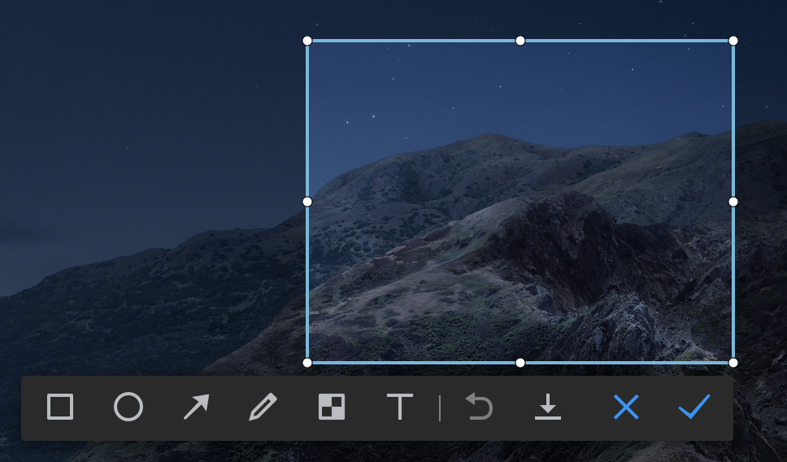
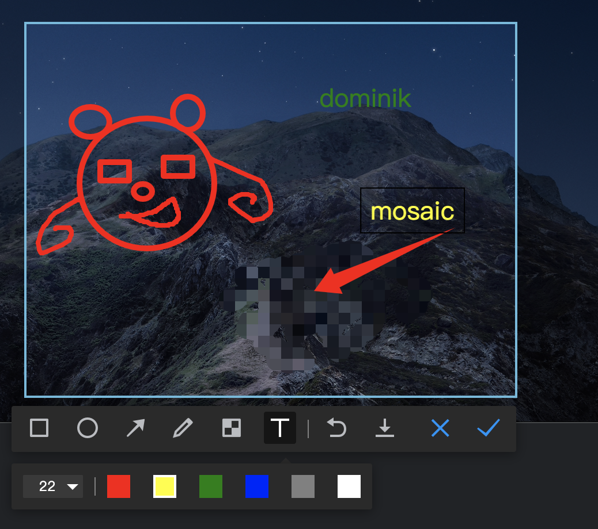

# electron-screencapture

> 实习期间模仿写的仿企业微信截图工具

### 首先效果图:





## 实现功能

<hr>

### 1. 涂鸦

<ul>
<li>矩形</li>
<li>椭圆</li>
<li>箭头</li>
<li>马赛克</li>
<li>画笔</li>
<li>文字描述: 支持拖拽, 双击修改</li>
</ul>

### 2. Mac支持扩展屏

## 截图实现思路

<hr>

我写截图的时候思路主要参考了掘金这个楼主的文章,[<<从零开始用electron手撸一个截屏工具>>](https://juejin.im/post/6844903687706378247), [<<Electron 截图踩坑和优化集合>>](https://juejin.im/post/6844903697705598983)并在其基础上再进行改写和优化. electron的截图思路就是需要先获取截图按钮点下那一时间的屏幕图片信息,然后通过一个平台(可以canvas, 可以div) 将图片盖满屏幕展示, 需要一层蒙层盖住图片告诉用户已进入截图模式, 增加一个可操作区做后续的画图操作.

### 1. 创建截图窗口

```javascript
// screenMain.js 
  createCaptureWins() {
    if (captureWins.length) {
      console.log('create captureWin failed')
      return
    }
    const { screen } = require('electron') // 主进程使用,但根据生命周期不能放在js文件最头上引入,会造成初始化错误

    displays = screen.getAllDisplays() // 获取所有屏幕的信息初始化
    captureWins = displays.map((display) => {
      let captureWin = new BrowserWindow({
        /* 铺满整个屏幕 */
        width: display.bounds.width,
        height: display.bounds.height,
        x: display.bounds.x,
        y: display.bounds.y,
        webPreferences: {
          nodeIntegration: true,
          webviewTag: true,
          webSecurity: process.env.NODE_ENV === 'production'
        },
        fullscreen: platform === 'win32' || undefined,
        resizable: false,
        enableLargerThanScreen: true,
        skipTaskbar: true,
        show: false, // linux 下一定要设置, 一开始没设置,直接在下面设置hide会在linux多创建一个electron窗口
        movable: false,
        frame: false,
        transparent: true,
        focusable: true
      })
      if (platform === 'darwin') {
        captureWin.setAlwaysOnTop(true, 'screen-saver')
      }
      captureWin.setVisibleOnAllWorkspaces(true)
      captureWin.setFullScreenable(true)
      captureWin.hide()
      captureWin.loadURL(captureURL)

      // 调试用
      captureWin.webContents.closeDevTools() // 打开dev模式会白底不会透明
      captureWin.on('show', () => {
        globalShortcut.register('Esc', () => {
          this.reset()
        })
      })
      captureWin.on('closed', () => {
        globalShortcut.unregister('Esc')
        captureWin = null
      })
      return captureWin
    })
    console.log('create captureWin successfully', captureWins.length)
  }

  reset() {
    if (captureWins) {
      captureWins.forEach((win) => {
        win.close()
        win = null
      })
      captureWins = []
      displays = []
    }
  }
```

由于考虑到性能问题,先将截图窗口与主窗口一起初始化,然后隐藏,然后需要截图的时候显示截图窗口然后在推出的时候隐藏, 但这样有2个问题:

1. 使用desktopCapturer进行截图后会造成严重的内存泄漏问题, 在截完图后程序会变的很卡. 
2. 即使在退出前对渲染屏幕和画图用的canvas,使用clearRect做了清空处理,  但下一次有一瞬间显示一些上一次操作的历史记录然后在清空的情况. (如果有什么更好的解决方法, 可以指出)

于是,我考虑在截完图后销毁窗口再悄悄的重新生成截图窗口. 完整代码可参考ScreenMain.js

### 2. 触发截屏

通过点击截图按钮, 渲染进程向主进程发送事件

```javascript
// homeIndex.vue 
 startCapture() {
    ipcRenderer.send('SCREENSHOT::START')
 }
// src/mian/index.js
function createWindow () {
  mainWindow = new BrowserWindow ({
    .....
  })
  ......
  screenMaintool.useCapture() // 跟随mainWindow初始化截图窗口
}
// screenMain.js
  useCapture() {
    this.createCaptureWins()
    console.log('platform ', platform)
    if (platform === 'darwin') {
      this.initListernMac()
    } else {
      this.initListernLinux()
    }
  },
  initListernMac() {
    // 初始化ipc监听
    this.listenDisplayNumChange()
    ipcMain.on('SCREENSHOT::CLOSE', () => {
      this.reset()
    })
    ipcMain.on('SCREENSHOT::HIDE', () => {
      if (captureWins) {
        captureWins.forEach((win) => win.hide())
      }
    })
    ipcMain.on('SCREENSHOT::CREATE', () => {
      this.createCaptureWins()
    })
    ipcMain.on('SCREENSHOT::START', () => {
      console.log('IpcMain...... SCREENSHOT::START', captureWins.length)
      this.startMacScreenshot() // 开始执行获取屏幕信息的函数
    })
  },
```


### 3. 获取屏幕信息与优化

首先,获取屏幕信息的流程是主要是:

渲染进程触发屏幕截图(`ipcRenderer.send('IpcMain...... SCREENSHOT::START')`),渲染进程发送事件, 主进程接收事件,截图主进程发送事件通知截图渲染进程打开截图窗口

1. 初次尝试: 

   electron提供一个desktopCapturer的方法或者掘金楼主提供的Navigator.getSources,都可以获取屏幕截图的图片信息, 前者是获取一个数组,保存屏幕的信息,thumbnail.toDataURL()为屏幕的base64地址, 后者是通过录屏,获取屏幕的情况如何获取第一帧的屏幕信息. 但这两者方法在扩展屏中都表现不是很好,在扩展屏或者在单凭性能较差的Mac机器时打开,完整渲染出会有大概3s的延迟时间. 考虑到desktopCapturer是在渲染进程中使用的方法, 而实质在electron的源代码中可以看到desktopCapturer其实也向主进程发起了请求,当主进程获取到了屏幕信息然后在发给渲染进程, 那么既然这样,有没有方法可以在主进程中使用desktopCapturer呢?

2. 在主进程中使用desktopCapturer

   根据查阅源码,可以发现在主进程中使用desktopCapture的记录`require('process').electronBinding('desktop_capturer').createDesktopCapturer()`
   
   ```JavaScript
   getScreenSources() {
       return new Promise((resolve, reject) => {
         try {
            // 参考electron源码 desktop-capturer.ts // rpc-server.ts 61行, 引入getSources
           let desktopCapture = 
               require('process').electronBinding('desktop_capturer').createDesktopCapturer()
           const stopRunning = () => {
             if (desktopCapture) {
               desktopCapture.emit = null
               desktopCapture = null
             }
           }
           const emitter = new EventEmitter()
           emitter.once('finished', (_, sources) => {
             stopRunning()
             resolve(sources)
           })
           desktopCapture.emit = emitter.emit.bind(emitter)
           // 创建一个虚拟窗口, 取各个屏幕的w,h的最大值
           desktopCapture.startHandling(
             false,
             true,
             { width: Math.ceil(visiualScreenInfo.cutWidth), height: Math.ceil(visiualScreenInfo.cutHeight) },
             true
           )
         } catch (e) {
           reject(e)
         }
       })
     },
   ```
   
   虽然这次相比在渲染进程使用desktopCapture速度提升不好,但是缺点表现在. 1. 对扩展屏的情况下,打开速度对比企业微信来说还是较慢. 2.针对性能较弱的Mac机器无很大的提升. 3. 在主进程中使用desktopCapture在linux下无效.
   
   于是根据掘金截图文章的优化,最后我选择使用Mac底层的screencapture, 而linux则使用原生的DesktopCapture且设置单屏幕.
   
3. Mac原生截图

```JavaScript
let command = 'screencapture -x '
   let deletecommand = 'rm -rf '
   // displays 保存 在初始化截图窗口的getAlldisplays返回的窗口信息
   displays.forEach((display) => {
         displayHash[display.id] = display.id + '_' + new Date().getTime()
         command = command + path + displayHash[display.id] + '.png '
         deletecommand = deletecommand + path + displayHash[display.id] + '.png '
   })
   // command 最后会是 screencapture -x path(保存图片的地址) 屏幕1ID_时间.PNG 屏幕2ID_时间.PNG ... 有几个屏幕就跟几个图片名字
   // -x 只取消截图声音
```
   
```javascript
    ipcMain.on('SCREENSHOT:START', () => {
       startMacScreenshot() {
       state = fs.existsSync(require('os').homedir() + `/screen_shot`)
       if (!state) {
         fs.mkdirSync(require('os').homedir() + `/screen_shot/`)
       }
         // 利用node执行command
       exec(command, (error, stdout, stderr) => {
         if (error) throw error
         captureWins.forEach((captureWin) => {
           // 坑之一是captureWin.id 与 display(getAlldisplay)的id是不一样的
           const _win = displays.filter(
             (d) => d.bounds.x === captureWin.getBounds().x && d.bounds.y === captureWin.getBounds().y
           )[0] // 获取当前的屏幕信息
           captureWin.setSize(_win.bounds.width, _win.bounds.height)
           captureWin.webContents.send(
             'SCREENSHOT::OPEN_MAC',
             _win.bounds.width,
             _win.bounds.height,
             _win.scaleFactor,
             displayHash[_win.id]
           )
         })
       })
     },
    })
```

最后根据屏幕的ID,让对应的截图进程向对应的截图渲染进程发送需要的屏幕参数, 但这有个风险是无法保证displays的屏幕信息数组顺序与screencapture 截图出来的图片对应,但是目前使用感受上是一致的

### 4. 展示屏幕图片

首先使用Canvas的drawImage画图本身很耗时, 如果是MAC这种retina屏幕中,需要2:1才能高清的显示图片,那就更加, 需要画大原2倍的大小. 这里的思路是, 一个div1铺满屏幕背景设置对应的屏幕图片,一个div2当做蒙层盖在div1上,一个空maincanvas覆盖在div2上用于鼠标drag的时候画出drag的选框,由于maincanvas在div1, 和div2之上所以就会选区的图片是正常颜色,无选区的地方是有蒙层的. 选完选区后,显示和设置assiscanvas的位置,assiscanvas帮助涂鸦, 1. 是为了当涂鸦鼠标越过选区边界的时候不会超出, 2.处理马赛克的时候不会和涂鸦冲突.

```html
  <div id="capture" ref="capture">
    <div
      id="capture-desktop"
      v-if="this.currWin.bgPath"
      :style="{ backgroundImage: 'url(' + this.currWin.bgPath + ')' }"
    ></div>
    <div id="mask" class="mask"></div>
    <canvas id="capture-desktop-canvas"></canvas>
    <canvas
      id="assistant-canvas"
      v-if="!this.selectRect.disable"
      :style="{
        position: 'absolute',
        zIndex: 3
      }"
    ></canvas>
</div>
```

```javascript
      ipcRenderer.on('SCREENSHOT::OPEN_MAC', (e, w, h, scaleFactor, screenshotName) => {
        this.currWin.bgPath = basetool.fileInLocal(
          require('os').homedir() + path + screenshotName + '.png'
        )
        this.canvas.style.width = this.currWin.width + 'px'
        this.canvas.style.height = this.currWin.height + 'px'
        this.canvas.width = this.currWin.width * this.currWin.scaleFactor // 解决mac下模糊问题
        this.canvas.height = this.currWin.height * this.currWin.scaleFactor
        this.ctx.scale(this.currWin.scaleFactor, this.currWin.scaleFactor)
        // 2. 鼠标事件监听
        document.addEventListener('mousedown', this.onMouseDown)
        document.addEventListener('mouseup', this.onMouseUp)
        document.addEventListener('mousemove', this.onMouseMove)
        this.win.show()
      })
```

具体实现代码可以查看,github地址

## 涂鸦实现思路


### 1. 鼠标事件监听与情景

> 1. onMouseDown, onMouseMove, onMouseUp
> 2. 三个情景: 1. 选取截图选框. 2. 涂鸦 3. 移动截图选框/Resize截图选框

#### 1. 选取截图选框

画选框的逻辑就是绘制一个矩形外框,矩形里面绘制图片,然后绘制边框线

```javascript
    drawSelect(rect) {
      this.ctx.strokeStyle = '#67bade'
      this.ctx.lineWidth = this.currWin.scaleFactor
      // 绘制选中框
      let img = new Image()
      img.onload = () => {
        this.ctx.clearRect(0, 0, this.canvas.offsetWidth, this.canvas.offsetHeight)
        // maincanvas的大小是图片大小的两倍
        this.ctx.drawImage(
          img,
          rect.sx * this.currWin.scaleFactor,
          rect.sy * this.currWin.scaleFactor,
          rect.width * this.currWin.scaleFactor,
          rect.height * this.currWin.scaleFactor,
          rect.sx,
          rect.sy,
          rect.width,
          rect.height
        )
        this.ctx.strokeRect(rect.sx, rect.sy, rect.width, rect.height) // 画边框
        img.onload = null
        img = null
      }
      img.src = this.currWin.bgPath
    }
```

非特殊情况, mousedown, mousemove, mouseup 绑定在document上,这样可以在mainCanvas上进行

1. 选择选区 2. 调整选区大小 3.移动选区 4. 画图.  

通过`isInArea`判断是否在选区内

当选框完成后初始化assCanvas的大小位置与选框的位置一致,在mainCanvas上通过DrawCircles画resize的点.  

```javascript
// 绘制resize点
    drawCircles(w, h, x, y) {
      // 1. 选好选区后画圆点
      // 2. 移动选框时也要画圆点
      // 3. 进入画图模式不需要画圆点
      let circles = [
        [0, 0],
        [w / 2, 0],
        [w, 0],

        [0, h / 2],
        [w, h / 2],

        [0, h],
        [w / 2, h],
        [w, h]
      ]
      circles = circles.map(([cx, cy]) => {
        return [cx + x, cy + y]
      })
      this.ctx.fillStyle = 'white'
      this.ctx.strokeStyle = 'black'
      this.ctx.lineWidth = 1
      circles.forEach((circle) => {
        this.ctx.beginPath()
        this.ctx.arc(circle[0], circle[1], 3, 0, Math.PI * 2)
        this.ctx.fill()
        this.ctx.stroke()
      })
    }
```

#### 2. 涂鸦的逻辑处理

进入涂鸦模式不能再Resize, 因为resize的点都画在mainCanvas上所以需要重新在画布画一遍无点的内容. 为了能实现撤销的功能,所以需要在每次mousedown的时候保存当前的记录, this.recordEvents. 

在画矩形,椭圆这类. 为了防止在move的时候画下每一次move时的标记,所以需要先清除画布,然后恢复最近保存的记录,然后再按新坐标画新图案. 

```javascript
// down的时候保存记录    
recordEvents() {
      // mosaic capture-desktop-canvas, // 其他画在assist-canvas
      let currentData
      if (this.curShape.type === 'mosaic') {
        currentData = this.ctx.getImageData(0, 0, this.canvas.width, this.canvas.height)
      } else {
        currentData = this.assCtx.getImageData(0, 0, this.assCanvas.width, this.assCanvas.height)
      }
  		// shapes负责收集
      this.shapes.push({
        type: this.curShape.type,
        data: currentData,
        shape: this.curShape
      })
    }
// move的时候, 以画矩形为例. 
  draw(shapes) {
    const ctx = this.ctx
    ctx.lineWidth = this.lineWidth * this.scaleFactor
    ctx.strokeStyle = this.strokeStyle
    // 清楚当前画布
    ctx.clearRect(
      0,
      0,
      this.asscanvas.offsetWidth * this.scaleFactor,
      this.asscanvas.offsetHeight * this.scaleFactor
    )
    if (shapes.length > 1) ctx.putImageData(shapes[shapes.length - 1].data, 0, 0)
    ctx.beginPath()
    ctx.rect(this.startX * this.scaleFactor, this.startY * this.scaleFactor, (this.endX - this.startX) * this.scaleFactor, (this.endY - this.startY) * this.scaleFactor)
    ctx.stroke()
  }
```

**为了保证马赛克(原理是取像素平均值)不和其他涂鸦冲突,马赛克画在maincanvas层,其他画在assCanvas层**

#### 3. 移动截图选框/Resize截图选框

移动截图选框的逻辑是根据鼠标拖动来改变drawImage的x和y, width和height不变

Resize: 首先需要监听鼠标的移动, mousemove是全局下, 判断鼠标的位置是否在resize点上, 若在, 设置变量 selectAnchor保存, 当movedown的时候判断selectAnchor是否为空, 为空 进入移动选框模式, 存在进入调整选框大小模式

### 2. 马赛克

受刮刮乐的启发,点击马赛克选项后使用getImageData获取当前canvas的图片,然后创建一个临时canvas将图片马赛克处理然后画在临时canvas然后再将临时canvas.toDataURL转出图片base64地址放在mainCanvas上渲染,通过css来控制背景的位置大小

```html
    <canvas
      id="capture-desktop-canvas"
      :style="{
        backgroundImage: 'url(' + this.mosaicPicBase64 + ')',
        background: 'no-repeat',
        backgroundPosition:
          this.selectRect.x + this.currWin.scaleFactor + 'px ' + (this.selectRect.y + this.currWin.scaleFactor) + 'px',
        backgroundSize:
          this.selectRect.width -
          2 * this.currWin.scaleFactor +
          'px ' +
          (this.selectRect.height - 2 * this.currWin.scaleFactor) +
          'px'
      }"
    ></canvas>
```

```javascript
    makeMosicCanvas() {
      const asscanvas = document.createElement('canvas')
      const assctx = asscanvas.getContext('2d')
      // 2 * this.currWin.scaleFactor边框粗细
      asscanvas.width = (this.selectRect.width - 2 * this.currWin.scaleFactor) * this.currWin.scaleFactor
      asscanvas.height = (this.selectRect.height - 2 * this.currWin.scaleFactor) * this.currWin.scaleFactor
      // 获取选框内的图片资源, 画马赛克原图使用
      const originImageData = this.ctx.getImageData(
        (this.selectRect.x + this.currWin.scaleFactor) * this.currWin.scaleFactor,
        (this.selectRect.y + this.currWin.scaleFactor) * this.currWin.scaleFactor,
        (this.selectRect.width - 2 * this.currWin.scaleFactor) * this.currWin.scaleFactor,
        (this.selectRect.height - 2 * this.currWin.scaleFactor) * this.currWin.scaleFactor
      ).data
      var r, g, b
      for (let y = 0; y <= asscanvas.height; y += 10 * this.currWin.scaleFactor) {
        for (let x = 0; x <= asscanvas.width; x += 10 * this.currWin.scaleFactor) {
          /*
          获取具体位置上像素点的RGB值，然后在canvas上重新绘制图片
           */
          r = originImageData[(y * asscanvas.width + x) * 4]
          g = originImageData[(y * asscanvas.width + x) * 4 + 1]
          b = originImageData[(y * asscanvas.width + x) * 4 + 2]
          /*
          在图像具体位置生成马赛克
           */
          assctx.fillStyle = `rgba(${r}, ${g}, ${b})`
          assctx.fillRect(x, y, 10 * this.currWin.scaleFactor, 10 * this.currWin.scaleFactor)
        }
      }
      this.mosaicPicBase64 = asscanvas.toDataURL('image/PNG')
    },
```

这样就是maincanvas被分成两部,background层+画布层,现在需要做的就是在鼠标move的时候将画布层的东西刮掉显示底层的东西, 这里在话mosaic的时候将ctx设置成`ctx.globalCompositeOperation = "destination-out"`, 结束mosaic模式下换回'source-over'`

### 3. 文字

文字部分不同其他部分, 文字通过div操作, 当初次选文字会创建一个大小位置跟选区一样的div.textContainer, 和一个可编辑的div,textHelper.  

div.textContainer用来存放textNode和textHelper.  div.textContainer要使用绝对布局,overflow:hidden, 这样textNode在移动的时候移除边界会被隐藏

textHelper用辅助来跟随鼠标的点击移动,当textHelper输入文字后再点击别处,会创建一个div.textNode来保存textHelper的内容,textHelper隐藏内容清空,通过textContainer,.appendChild加入textNode,位置与textHelper一致.同时绑定鼠标监听来做移动和修改的处理.

撤销有四个情景: 

1. textHelper(无内容清空多次点击鼠标只记录一次) 
2. textmove(每次移动前记录当下的x,y撤销的时候恢复xy), 
3. textNode(删除textContainer内的最后一个node节点)
4. editortext 修改节点内容

在双击修改节点内容时也会触发单击节点的回调函数, 所以为了防止冲突, 设置this.editorText和 move的距离 做判断,在双击节点时候都会产生鼠标的移动而被计入成textmove 所以当移动距离大于1才能被记录, 其次当修改内容不一致的时候才记录editortext.

```javascript
  createTextNode(shapes) {
    const textHelper = document.getElementById('textHelper')
    const textNode = document.createElement('div')
    // .... 
    textNode.innerText = textHelper.innerText
    textHelper.innerText = ''
    // .... 
    document.getElementById('textContainer').appendChild(textNode)
    let flag = false
    let move = false
    textNode.onmousedown = (e) => {
      // 防止单次点击与双击冲突
      if (this.editorText) return
      if (textHelper.innerText.length > 0 ) this.createTextNode(shapes)
      textHelper.style.display = 'none'

      const left = parseInt(textNode.style.left)
      const top = parseInt(textNode.style.top)

      this.startX = e.clientX
      this.startY = e.clientY
      flag = true

      document.onmousemove = (e) => {
        const moveLength = Math.sqrt(Math.pow(this.startX - e.clientX, 2) + Math.pow(this.startY - e.clientY, 2))
        console.log(moveLength)
        if (!this.editorText && moveLength > 1 && flag) {
          move = true
          textNode.style.left = left + (e.clientX - this.selectRect.x - left)  + 'px'
          textNode.style.top = top + (e.clientY - this.selectRect.y - top) + 'px'
        }
      }


      document.onmouseup = (e) => {
        if(flag && move && !this.editorText) {
          shapes.push({
            type: 'textmove',
            data: {
              node: textNode,
              left: left,
              top: top
            },
            shape: this
          })
          document.onmousemove = null
          document.onmouseup = null
        }
        flag = false
        move = false
      }
    }
    textNode.ondblclick = (e) => {
      this.editorText = true
      this.node = textNode
      let innerText = textNode.innerText
      textNode.setAttribute('contenteditable', true)
      textNode.style.cursor = 'text'
      textNode.style.border = '1px solid black'
      textNode.onblur = () => {
        this.editorText = false
        textNode.style.cursor = 'move'
        textNode.style.border = ''
        textNode.setAttribute('contenteditable', false)
        if (textNode.innerText !== innerText) {
          shapes.push({
            type:'editortext',
            data: {
              node:textNode,
              Text: innerText
            },
            shape: this
          })
        }
      }
    }
  }
```

### 4. 撤销

整体的思路是每次draw之前都会记录当前状态. 那么在canvas中,由于是画马赛克,文字,画笔这种不规律的操作时, 只记录下前一次和后一次的x,y 是无法复原的. 因此除开文字的部分其他基于canvas的操作我选择使用, getImageData`和`putImageData`进行保存和撤回

首先有一个Shapes的类

```javascript
export class Shapes extends Shape {
  constructor() {
    super()
    this.shapes = [] // 用来保存每一次执行的shape对象
  }
  push(currentImageData) {
    this.shapes.push(currentImageData) // 在movedown的时候,非文字调用recordEvents(上文涂鸦逻辑实现)
  }
  undo() {
    const curShape = this.shapes[this.shapes.length - 1].shape // 待撤销的data
    curShape.undo(this.shapes) // 负责分发执行者执行undo
    this.shapes.pop()
  }
  canUndo() {
    return this.shapes.length > 0
  }
  reset() {
    this.shapes = []
  }
}
```

每一次movedown时,记录

```JavaScript
    onMouseDown(e) {
    	 // .....
        if (!this.isEmptyObject(this.curShape)) {
        	// ....
          this.curShape.start(e.clientX - this.selectRect.x, e.clientY - this.selectRect.y)
          if (this.curShape.type !== 'text') {
            this.recordEvents()
          } else {
            this.curShape.draw(this.shapes.shapes)
            // 这里就是画textHelper, 将e.offSetX 和 e.offSetY或者e.clientX - (assCanvas的left值)/e.clientY - (assCanvas的Top值)当做textHelper的left和top,
          }
        }
    }
```

每一个Rectangle,ellipse... 类都有自己对应的draw函数和undo函数

在mousemove时执行图形对象的draw方法

```JavaScript
    onMouseMove(e) {
			if (!this.isEmptyObject(this.curShape) && this.curShape.isDrawing) {
          this.curShape.endX = e.clientX - this.selectRect.x
          this.curShape.endY = e.clientY - this.selectRect.y
          this.curShape.draw(this.shapes.shapes) // 执行图片对象的draw方法
      }
    }
```

当点击撤销时, 调用shape类的canUndo方法,也就是判断this.shapes是否存有绘图对象,主要用三个属性,type,data(如果是画在canvas中的保存的是imageData,如果是text的类型储存是位置信息),shape. 如果存在绘图对象,就把对象弹出,并执行该对象的undo方法

以画笔为例:

```JavaScript
export class Curve extends Shape {
  constructor(asscanvas, selectRect, scaleFactor) {
    super();
    this.type = 'curve'
    this.ctx = asscanvas.getContext('2d')
    this.asscanvas = asscanvas
    this.selectRect = selectRect
    this.scaleFactor = scaleFactor
  }
  draw() {
    // ....
  }
  reset() {
    super.reset()
    this.down = false
  }
  undo(shapes) {
    if (shapes.length === 1) {
      this.ctx.clearRect(0, 0, this.asscanvas.width, this.asscanvas.height)
    } else {
      this.ctx.putImageData(shapes[shapes.length - 1].data, 0, 0)
    }
  }
}
```
